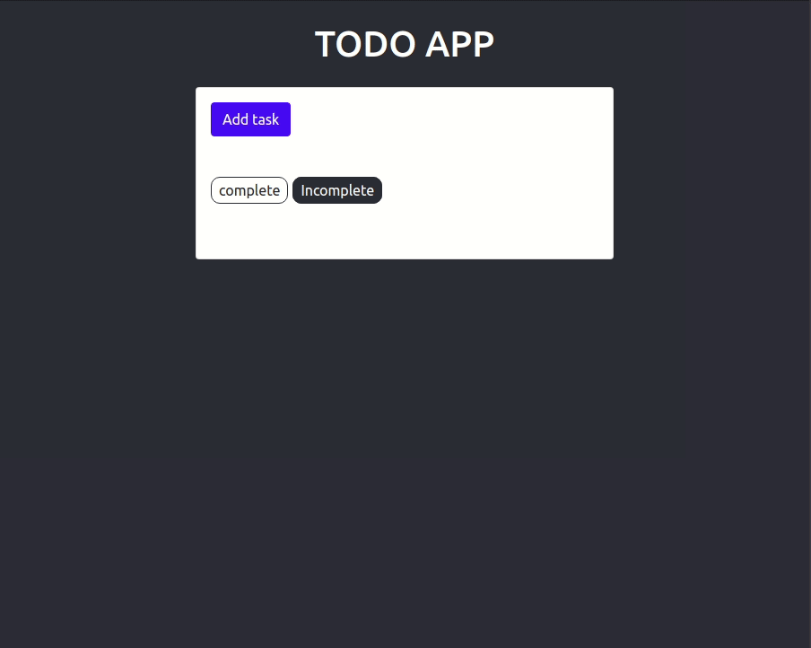

# To-Do application Using Django and React

For this application, React serves as the frontend, or client-side framework, handling the user interface and getting and setting data via requests to the Django backend, which is an API built using the Django REST framework (DRF).



## Prerequisites

- Python3

- Nodejs
  

## Step 1 — Setting Up the Backend

- Go to backend folder and run

```bash
pip3 install -r requirements.txt
```

- Start the backend

```bash
python3 manage.py runserver
```

## Step 2 — Setting Up the Frontend

- Install yarn if needed

```bash
npm install --global yarn
```

-- Go to frontend folder

```bash
yarn start
```

Now when you visit http://localhost:3000 with your web browser, your application will allow you to READ, CREATE, UPDATE, and DELETE tasks.